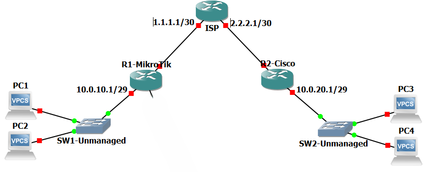

# 🔻ارتباط بین میکروتیک و سیسکو با GRE+IPsec
## 🔹محیط کار و توپولوژی

 
**GNS3**⬆️

## 🔹هدف
- با **استفاده از** `GRE`و`IPsec`ارتباط بین 2 روتر Cisco و MikroTik رو برقرار میکنیم.
    
- **هدف** اینه که یه سناریوی مرسوم ولی نسبتا سخت (بخاطر وجود سیسکو) رو پیاده‌سازی کنیم!

## 🔹اقدامات و کانفیگ‌ها
### 🔸ارتباطات اولیه
* نوشتن Default Route⬇️
![[1-Default Route.png]]

### 🔸راه‌اندازی`GRE`
* تعریف Tunnel روی روترها⬇️
![[2-GRE.png]]

### 🔸روتنیگ با`GRE`
* نوشتن Static Route برای LANها⬇️
![[3-Routing.png]]

### 🔸اعمال`IPSec`روی`GRE`
- میکروتیک⬇️
![[4-MikroTik.png]]

- سیسکو⬇️
![[4-Cisco.png]]

## 🔹راستی آزمایی
1. تست ارتباط اولیه⬇️
![[1-Test.png]]

2. تست ارتباط`GRE`ها⬇️
![[2-Test.png]]

3. تست ارتباط Clientها با`GRE`⬇️
![[3-Test.png]]

4. بررسی اطلاعات⬇️
![[4-Vertify.png]]

5. تست ارتباط با `IPSec`+`GRE`⬇️
![[4-Test.png]]

## 🔹مشکل
- **مشکل**م این بود که Phase 1 (IKE) درست بود، اما Phase 2 (IPSec) به مشکل میخورد و به همین خاطر GRE Tunnelها از کار می‌افتادن و Routeها از دسترس خارج میشدن🛑
    
- **راه‌حل**‌ش هم ChatGPT بود و به کمکش فهمیدم که بهتره همه‌چیز (حتی پروتکل‌های داخل Policyها) باهم یکی باشه و یکبار هم بین GRE Tunnelها`ping`بزنیم تا همه‌چی از اول انجام شده باشه؛ چون مشکلی داخل کانفیگ‌های اصلی نبود✅

## 🔹نتیجه
>سناریو موفقیت‌‍آمیز بود✅
